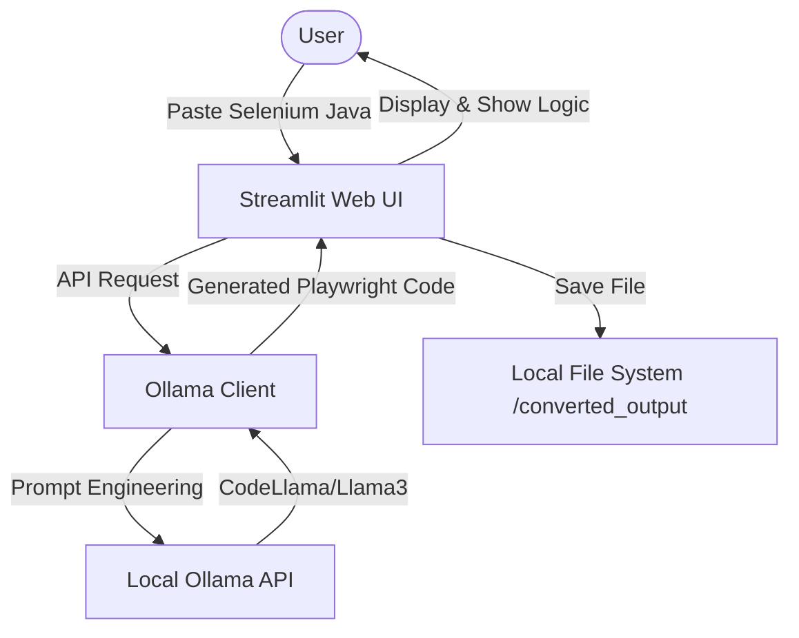

# 🤖 Selenium to Playwright Converter (LLM Powered)

A premium, local LLM-powered web application to migrate Selenium Java (TestNG) tests into modern, idiomatic Playwright (TypeScript/JavaScript). Built with the B.L.A.S.T protocol for high reliability.

---

## 🏗️ Architecture Overview



---

## ✨ Features

- **Local & Private**: All conversions happen on your machine using Ollama. Your code never leaves your network.
- **Idiomatic Conversion**: Not just a 1:1 translation. The system prioritizes Playwright best practices (auto-waiting, locators, context).
- **Dual Language Support**: Output to either TypeScript or JavaScript.
- **Instant Preview**: Side-by-side comparison of source and converted code.
- **History & Persistence**: All converted files are automatically saved with timestamps.
- **Conversion Explainer**: Get a breakdown of *why* certain changes were made (e.g., Implicit wait vs. Auto-waiting).

---

## 🛠️ Technology Stack

- **Frontend/Backend**: [Streamlit](https://streamlit.io/) (Python)
- **AI Orchestration**: [Ollama](https://ollama.com/)
- **Models**: `codellama`, `llama3.2`
- **Protocol**: B.L.A.S.T (Blueprint, Link, Architect, Stylize, Trigger)

---

## 🚀 Getting Started

### Prerequisites
1. **Python 3.10+**
2. **Ollama** installed and running.
3. Pull the required models:
   ```bash
   ollama pull codellama
   ollama pull llama3.2
   ```

### Installation
1. Clone the repository:
   ```bash
   git clone https://github.com/teja290/Selenium2Playwright-Converter-LLM.git
   cd Selenium2Playwright-Converter-LLM
   ```
2. Install dependencies:
   ```bash
   pip install -r requirements.txt
   ```

### Running the App
```bash
streamlit run app.py
```
Open `http://localhost:8501` in your browser.

---

## 📂 Project Structure
- `app.py`: Main Streamlit application and UI logic.
- `tools/ollama_client.py`: Bridge between UI and local LLM.
- `converted_output/`: Directory where generated Playwright tests are stored.
- `gemini.md`: Project Constitution and Data Schemas.
- `task_plan.md`: Development roadmap and phase tracking.

---

## 📝 Behavioral Rules (B.L.A.S.T)
- **Prioritize Reliability**: Use idiomatic Playwright patterns over strict 1:1 Java translation.
- **Data-First**: All tools are built around strict JSON schemas.
- **Self-Healing**: Errors in conversion logic trigger architectural updates to prevent repetition.

---
Built with ❤️ for the Automation community.
